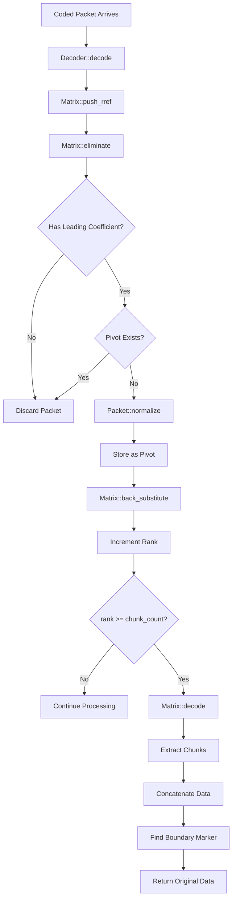

# `rlnc-rs`

## Decoding

The RLNC decoder implements online Gaussian elimination to reconstruct original data from coded packets as they arrive over the network. Unlike traditional batch processing, packets are processed immediately using an optimized matrix structure.

### Architecture Overview



### Key Components

**Decoder** (`src/decode.rs`)
- Main interface for decoding coded packets
- Manages chunk size and count parameters
- Delegates matrix operations to internal Matrix

**Matrix** (`src/matrix.rs`)
- Maintains RREF (Reduced Row Echelon Form) matrix
- Tracks pivot positions using `Vec<Option<usize>>`
- Performs online Gaussian elimination

**RLNCPacket** (`src/primitives/packet.rs`)
- Contains coding vector (coefficients) and data payload
- Supports normalization and row operations in GF(2^8)
- Provides leading coefficient detection

### Online Processing Algorithm

#### 1. Packet Elimination
```rust
fn eliminate(&mut self, packet: &mut RLNCPacket) {
    // Process pivots in column order
    for (col, row) in self.pivots.iter().enumerate()
        .filter_map(|(i, &r)| r.map(|r| (i, r))) {
        if !packet.coding_vector[col].is_zero() {
            let factor = packet.coding_vector[col] / pivot_coeff;
            packet.subtract_row(&pivot_row, factor);
        }
    }
}
```

#### 2. Pivot Management
- `pivots[col] = Some(row_idx)` maps column index to pivot row
- O(1) lookup for pivot detection and elimination
- Maintains sparse representation of matrix

#### 3. Incremental Back-Substitution
```rust
fn back_substitute(&mut self, new_row_idx: usize) {
    // Clean only the NEW pivot column in PREVIOUS rows
    for i in 0..new_row_idx {
        if !self.data[i].coding_vector[new_pivot_col].is_zero() {
            self.data[i].subtract_row(&new_row, factor);
        }
    }
}
```

#### 4. Final Reconstruction
```rust
pub(crate) fn decode(&self, chunk_size: usize) -> Result<Bytes, RLNCError> {
    // Extract chunks from pivot rows (already in RREF)
    let mut chunks = vec![vec![0u8; chunk_size]; self.chunk_count];
    for (col, row_idx) in self.pivots.iter().enumerate()
        .filter_map(|(i, &r)| r.map(|r| (i, r))) {
        // Copy GF256 data to u8 chunks
        for i in 0..chunk_size {
            chunks[col][i] = self.data[row_idx].data[i].into();
        }
    }
    
    // Concatenate chunks and find boundary marker
    let decoded = chunks.concat();
    let boundary_pos = decoded.iter().rposition(|&b| b == BOUNDARY_MARKER)?;
    Ok(decoded[..boundary_pos])
}
```

### Memory Layout and Optimization

The decoder uses several optimizations for efficiency:

1. **Sparse Matrix Storage**: Only stores linearly independent packets
2. **Pivot Tracking**: Direct O(1) column-to-row mapping via `pivots` array  
3. **Online Processing**: Eliminates packets immediately upon arrival
4. **Early Termination**: Stops when `rank >= chunk_count`
5. **Incremental RREF**: Maintains reduced form throughout process

### Decoding Flow Example

For a 3-chunk system:

1. **Packet 1**: `[2,3,1] → data1`
   - No elimination needed (first packet)
   - Normalize: `[1,1.5,0.5] → normalized_data1`  
   - Store as pivot for column 0
   - `rank = 1`

2. **Packet 2**: `[1,2,3] → data2`
   - Eliminate against column 0: `[0,0.5,2.5]`
   - Normalize: `[0,1,5] → normalized_data2`
   - Store as pivot for column 1, back-substitute
   - `rank = 2`

3. **Packet 3**: `[4,5,2] → data3`  
   - Eliminate against columns 0,1: `[0,0,1]`
   - Store as pivot for column 2
   - `rank = 3 = chunk_count` → **DECODE COMPLETE**

The matrix maintains RREF form throughout, enabling immediate extraction once sufficient rank is achieved.