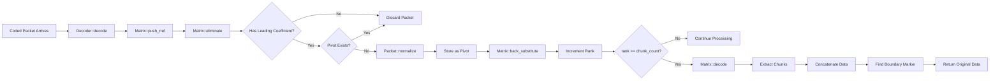

# `rlnc-rs`

RLNC (Random Linear Network Coding) is an erasure coding scheme that allows for the reconstruction of original data from any threshold of coded packets as they arrive over the network.
Erasure coding can also be used to more efficiently transfer larger messages over multi-hop broadcast networks, because it allows for more efficient use of bandwidth. RLNC is especially suited for this use case because it assumes no specific network topology, and can be used in permissionless networks with high churn. 

To learn more about RLNC, I recommend [these lectures](https://www.youtube.com/playlist?list=PLtngEjKSkXc04VBKxJR-ZNFKhyxW2Uny2).

RLNC has been proposed in a theoretical BitTorrent design by Microsoft Research called [Avalanche](https://en.wikipedia.org/wiki/Avalanche_(P2P)), which was subsequently [criticized](https://archive.ph/20121216081831/http://bramcohen.livejournal.com/20140.html) by Bram Cohen (BitTorrent creator) for the compute overhead not being practical.
In most cases, compute overhead is not a problem anymore, and can be heavily optimized. [TODO: Add benchmarks]

## Byzantine Fault Tolerance
RLNC is great, but it's not deployable in adversarial networks as-is. [Pollution attacks](https://en.wikipedia.org/wiki/Homomorphic_signatures_for_network_coding) are extremely destructive, and can cause the network to fail to reconstruct the original data. Therefore, we need to add some form of authentication and integrity protection to the packets, which is the challenging part.

The general flow would work like this:
- Source node has known public key
- Source node divides data into chunks and commits to them (using signature)
- Source node encodes data into packets (i.e. combines chunks with coding vector)
- **The commitment is also combined, and remains valid!**
- Source node sends coded packets to the network
- Receiving nodes can individually ensure the authenticity of the coded packets, and the integrity of the data
- This specifically means that receiving nodes can verify that a) the original data was broadcast by the source node, and b) the data was not invalidly modified by a malicious node in the network

There are some options for authentication and integrity protection, all with different tradeoffs (and lack of implementations):

- [Merkle tree authentication](https://en.wikipedia.org/wiki/Merkle_tree)
    - This is the simplest option, and is the most widely used.
    - It's easy to implement, and is relatively efficient.
    - It only works in source-only mode, not with recoding.
    - Binding for small field sizes (e.g. `GF(2^8)`)
- [Pedersen commitments](https://en.wikipedia.org/wiki/Pedersen_commitment)
    - Proposed in https://ethresear.ch/t/faster-block-blob-propagation-in-ethereum/21370
    - Works in recoding setting because it's additive homomorphic
    - Requires large prime fields (e.g. `GF(2^256)`) to be binding (expensive in computation, at least 100x slower than `GF(2^8)`)
- [Homomorphic signatures](https://en.wikipedia.org/wiki/Homomorphic_signatures_for_network_coding)
    - Proposed in https://eprint.iacr.org/2006/025.pdf
    - Proposed in https://eprint.iacr.org/2011/018.pdf (lattice cryptography, secure even with small field sizes, PQ secure)
    - Works in recoding setting because it's additive homomorphic
    - **Have not found any production implementations!**
- [LtHash](https://engineering.fb.com/2019/03/01/security/homomorphic-hashing/)
    - Proposed in https://engineering.fb.com/2019/03/01/security/homomorphic-hashing/ (Note that this specifically won't work because it's only homomorphic for XOR operations)
    - Maybe there are variants of these hashes that are additively homomorphic or a way to leverage these for what we need?
    - **Unsure if this is secure with small fields, to investigate!**

It comes down to this: for authentication in full RLNC, you need either an additively homomorphic hash, commitment, or signature.
Options that are implemented in production (like Pedersen commitments) require large prime fields, which are expensive in computation.

Homomorphic signatures like in [this paper](https://eprint.iacr.org/2011/018.pdf) are not implemented in production and maybe not fully proven? But seem very promising.

## Decoding

The RLNC decoder implements online Gaussian elimination to reconstruct original data from coded packets as they arrive over the network. Unlike traditional batch processing, packets are processed immediately using an optimized matrix structure.

### Architecture Overview



### Key Components

**Decoder** (`src/decode.rs`)
- Main interface for decoding coded packets
- Manages chunk size and count parameters
- Delegates matrix operations to internal Matrix

**Matrix** (`src/matrix.rs`)
- Maintains RREF (Reduced Row Echelon Form) matrix
- Tracks pivot positions using `Vec<Option<usize>>`
- Performs online Gaussian elimination

**RLNCPacket** (`src/primitives/packet.rs`)
- Contains coding vector (coefficients) and data payload
- Supports normalization and row operations in GF(2^8)
- Provides leading coefficient detection

### Online Processing Algorithm

#### 1. Packet Elimination
```rust
fn eliminate(&mut self, packet: &mut RLNCPacket) {
    // Process pivots in column order
    for (col, row) in self.pivots.iter().enumerate()
        .filter_map(|(i, &r)| r.map(|r| (i, r))) {
        if !packet.coding_vector[col].is_zero() {
            let factor = packet.coding_vector[col] / pivot_coeff;
            packet.subtract_row(&pivot_row, factor);
        }
    }
}
```

#### 2. Pivot Management
- `pivots[col] = Some(row_idx)` maps column index to pivot row
- O(1) lookup for pivot detection and elimination
- Maintains sparse representation of matrix

#### 3. Incremental Back-Substitution
```rust
fn back_substitute(&mut self, new_row_idx: usize) {
    // Clean only the NEW pivot column in PREVIOUS rows
    for i in 0..new_row_idx {
        if !self.data[i].coding_vector[new_pivot_col].is_zero() {
            self.data[i].subtract_row(&new_row, factor);
        }
    }
}
```

#### 4. Final Reconstruction
```rust
pub(crate) fn decode(&self, chunk_size: usize) -> Result<Bytes, RLNCError> {
    // Extract chunks from pivot rows (already in RREF)
    let mut chunks = vec![vec![0u8; chunk_size]; self.chunk_count];
    for (col, row_idx) in self.pivots.iter().enumerate()
        .filter_map(|(i, &r)| r.map(|r| (i, r))) {
        // Copy GF256 data to u8 chunks
        for i in 0..chunk_size {
            chunks[col][i] = self.data[row_idx].data[i].into();
        }
    }
    
    // Concatenate chunks and find boundary marker
    let decoded = chunks.concat();
    let boundary_pos = decoded.iter().rposition(|&b| b == BOUNDARY_MARKER)?;
    Ok(decoded[..boundary_pos])
}
```

### Memory Layout and Optimization

The decoder uses several optimizations for efficiency:

1. **Sparse Matrix Storage**: Only stores linearly independent packets
2. **Pivot Tracking**: Direct O(1) column-to-row mapping via `pivots` array  
3. **Online Processing**: Eliminates packets immediately upon arrival
4. **Early Termination**: Stops when `rank >= chunk_count`
5. **Incremental RREF**: Maintains reduced form throughout process

### Decoding Flow Example

For a 3-chunk system:

1. **Packet 1**: `[2,3,1] → data1`
   - No elimination needed (first packet)
   - Normalize: `[1,1.5,0.5] → normalized_data1`  
   - Store as pivot for column 0
   - `rank = 1`

2. **Packet 2**: `[1,2,3] → data2`
   - Eliminate against column 0: `[0,0.5,2.5]`
   - Normalize: `[0,1,5] → normalized_data2`
   - Store as pivot for column 1, back-substitute
   - `rank = 2`

3. **Packet 3**: `[4,5,2] → data3`  
   - Eliminate against columns 0,1: `[0,0,1]`
   - Store as pivot for column 2
   - `rank = 3 = chunk_count` → **DECODE COMPLETE**

The matrix maintains RREF form throughout, enabling immediate extraction once sufficient rank is achieved.